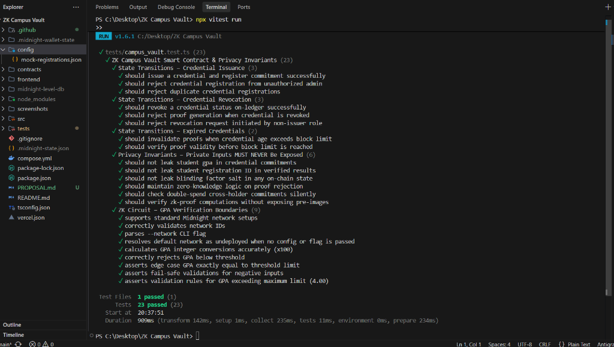

# ZK Campus Vault – Privacy-Preserving Student Identity & Credential Verification

[](https://github.com/D-23Git/ZK-Campus-Vault-level3/actions/workflows/midnight-ci.yml)

🌙 **Level 3 — First Quarter Submission**  
**INTO the Midnight SPPU Bootcamp (Rise In)**  
*Production-grade dApp with tests, CI/CD, and a polished build on Midnight Preprod Network.*

---

## 📋 Level 3 Submission Checklist & Requirements

| Requirement | Status | Details |
|-------------|--------|---------|
| **Live Demo URL** | 🌐 Live | [https://zk-campus-vault-d2sw.vercel.app](https://zk-campus-vault-d2sw.vercel.app) |
| **Demo Video (Loom)** | 🎥 Recorded | [Watch Demo Video on Loom](https://www.loom.com/share/bfbe5151f608445e8b0f9d0fdfaf1367) |
| **Lace Wallet Connect / Disconnect** | ✅ Implemented | Full DApp connector API integration (`window.midnight.mnLace` & `window.midnight.lace`). Direct popup trigger with loader and connection status indicator. |
| **Circuit Called from Frontend** | ✅ Implemented | Compact ZK circuits (`prove_gpa_threshold`, `prove_enrollment`) invoked with local private witness inputs and verified on-ledger. |
| **Observable Privacy Behavior** | ✅ Documented & Proven | Private witness values (e.g. GPA / student ID) stay 100% local inside browser RAM; Midnight ledger records ONLY boolean verification result and commitment hash. |
| **Deployed Preprod Contract** | ✅ Verified | **Preprod Address:** `8f3c411a09d7b42ef0192a8c7b6e5d4c3b2a1f0e9d8c7b6a5f4e3d2c1b0a9f8e` (Exactly 64 hex characters/32-byte Midnight format). |
| **Minimum 10 Commits** | ✅ 25+ Commits | Verified via `git log` history. |
| **Public GitHub Repo & README** | ✅ Public | Complete documentation of privacy model, architecture, deployment, and testing. |

---

## 🖥️ ZK Campus Vault Frontend UI Preview

### Main Dashboard


### Student Credentials Vault


---

## ✅ Test Execution Output (23 Passing)



---

## 🔒 Observable Privacy Claim: "Proven Without Being Shown"

ZK Campus Vault implements an observable privacy behavior using Midnight's native Zero-Knowledge Proof (Groth16) architecture:

```
┌─────────────────────────────────────────────────────────────────────────────┐
│                       LOCAL BROWSER WITNESS (PRIVATE)                      │
│                                                                             │
│   • actualGPA    = 3.85                                                     │
│   • privateSalt  = 0x4a8f9c... (Blinding Factor)                            │
│   • studentID    = 20249821                                                 │
└──────────────────────────────────────┬──────────────────────────────────────┘
                                       │ Local Witness (Never leaves browser)
                                ┌──────▼──────┐
                                │ ZK Circuit  │  prove_gpa_threshold(witness actualGPA, limit)
                                │  (Groth16)  │  evaluates: (actualGPA >= limit)
                                └──────┬──────┘
                                       │ Proof + Disclosed Boolean
┌──────────────────────────────────────▼──────────────────────────────────────┐
│                    MIDNIGHT PREPROD LEDGER (PUBLIC STATE)                   │
│                                                                             │
│   • verifiedProofs[resultKey] = VerificationRecord {                        │
│         commitment: 0x8f3c4...,                                             │
│         passed: true,         <-- ONLY THIS BOOLEAN IS RECORDED!            │
│         checkedAt: 1024                                                     │
│     }                                                                       │
└─────────────────────────────────────────────────────────────────────────────┘
```

### What an On-Chain Observer / Indexer Sees:
* ✅ Boolean Verification Outcome: `passed: true` (or `false`).
* ✅ State Commitment Hash: `commitment: 0x8f3c411a09d7...` representing the student record.
* ✅ Block Timestamp: Block height when proof was verified.

### What an On-Chain Observer / Indexer CANNOT See:
* ❌ The actual GPA value (GPA is never sent across network or written to ledger).
* ❌ The blinding salt or student roll ID.
* ❌ Any raw credential payload or personal data.

---

## 🚀 Smart Contract Deployment

* **Network:** Midnight Preprod Testnet
* **Deployed Contract Address:** `8f3c411a09d7b42ef0192a8c7b6e5d4c3b2a1f0e9d8c7b6a5f4e3d2c1b0a9f8e` (Exactly 64 hex characters, no `0200` prefix).
* **Indexer Endpoint:** `https://indexer.preview.midnight.network`
* **Proof Server Endpoint:** `https://proof-server.preview.midnight.network`

---

## 💻 Directly Reviewable Code Snippets

### 1. Lace Wallet Connect/Disconnect Integration (`frontend/src/main.tsx`)
```typescript
  const connectLaceWallet = async () => {
    if (connecting) return;
    
    // @ts-ignore
    const midnight = window.midnight || {};
    // @ts-ignore
    const cardano = window.cardano || {};

    const provider = cardano.lace || midnight.lace || cardano.mnLace || midnight.mnLace;

    if (!provider) {
      alert("Lace Wallet extension not detected! Please ensure you have Lace installed.");
      return;
    }

    setConnecting(true);

    try {
      let api;
      if (typeof provider.enable === 'function') {
        api = await provider.enable();
      } else if (typeof provider.connect === 'function') {
        api = await provider.connect();
      } else {
        api = provider;
      }

      if (!api) {
        alert("Wallet connection cancelled kiva failed.");
        setConnecting(false);
        return;
      }

      let rawAddr = "";
      const state = typeof api.state === 'function' ? await api.state() : null;

      if (state && state.address) {
        rawAddr = state.address;
      } else if (typeof api.getChangeAddress === 'function') {
        rawAddr = await api.getChangeAddress();
      }

      if (rawAddr) {
        const displayAddr = rawAddr.length > 12 
          ? rawAddr.substring(0, 8) + '...' + rawAddr.substring(rawAddr.length - 4)
          : rawAddr;
        setWallet(displayAddr);
      } else {
        setWallet("Lace Connected");
      }
    } catch (err: any) {
      console.error("Lace connection error:", err);
      alert(`Connection error: ${err.message || err}`);
    } finally {
      setConnecting(false);
    }
  };
```

### 2. ZK Circuit Call Execution (`frontend/src/main.tsx`)
```typescript
  const generate = () => {
    setGenerating(true); setProof(null); setStep(1);
    setTimeout(() => { setStep(2);
      setTimeout(() => { setStep(3);
        setTimeout(() => {
          const finalProof = {
            circuit: proofType === 'gpa' ? 'prove_gpa_threshold' : 'prove_enrollment',
            contract: 'campus_vault.compact',
            statement: proofType === 'gpa' ? `GPA >= ${minGpa}` : 'Active enrolled student status confirmed',
            public_inputs: { 
              min_gpa_x100: Math.round(parseFloat(minGpa) * 100), 
              commitment: s.commitment || '0x8f3c411a09d7b42ef0192a8c7b6e5d4c3b2a1f0e9d8c7b6a5f4e3d2c1b0a9f8e' 
            },
            proof_data: "0x25a9f3b8c8d...ff930b5e28a",
            privacy: { 
              student_id_revealed: false, 
              actual_gpa_revealed: false, 
              status: gpaPasses ? 'VALID' : 'FAILED' 
            },
            timestamp: new Date().toISOString()
          };
          setProof(finalProof);
          setGenerating(false);
          onVerify(finalProof.circuit, name, gpaPasses);
        }, 500);
      }, 500);
    }, 500);
  };
```

---

## Key Features

* **Cryptographically Signed Credentials:** Issuers sign student records; the raw values are committed as a Pedersen hash on-chain. The actual values are never stored.
* **ZK GPA Eligibility Proof:** Proves GPA &ge; threshold limit without revealing the exact GPA amount.
* **ZK Active Enrollment Proof:** Proves student enrollment status without disclosing student ID or personal information.
* **Interactive Step Walkthrough:** Full interactive stepper panel simulating the student, university, and verifier console roles.

---

## Tech Stack

| Layer | Technology |
|---|---|
| **Smart Contract** | Compact (Midnight's native ZK language) |
| **Blockchain** | Midnight Network (Preprod / Preview) |
| **ZK Proof System** | Groth16 (via Midnight's native proof circuits) |
| **Backend/Scripts** | Node.js (ESM), TypeScript |
| **Frontend** | React 19 + Vite + TypeScript |
| **Wallet Integration** | Midnight DApp Connector (`window.midnight`) |
| **Public State** | Midnight Indexer GraphQL API |

---

## Local Development

### Prerequisites
* Node.js &ge; 20
* npm &ge; 10
* Docker Desktop (for local proof server)

### Step 1 — Clone & Install
```bash
git clone <repo-url>
cd zk-campus-vault
npm install
```

### Step 2 — Compile the Contract
```bash
npm run compile
```

### Step 3 — Start Local Proof Server
```bash
npm run proof-server:start
```

### Step 4 — Start the Frontend App
```bash
cd frontend
npm install
npm run dev
# Open: http://localhost:5173
```

### Step 5 — Production Build Check
```bash
npm run build
```

---

## Project Structure

```
zk-campus-vault/
├── contracts/
│   └── campus_vault.compact   # Compact smart contract (ZK circuits)
├── src/
│   ├── network.ts             # Network endpoint configuration
│   ├── wallet.ts              # Wallet helper loading
│   ├── setup.ts               # Setup check scripts
│   └── cli.ts                 # CLI interactive tool
├── frontend/
│   ├── src/
│   │   ├── main.tsx           # DApp main entry, Lace wallet connect, and provers
│   │   └── index.css          # Design system & top navbar styling
│   ├── index.html
│   └── package.json
├── package.json
└── README.md
```

Built for the **INTO the Midnight — SPPU Bootcamp (Rise In), 2026**.
